# 1. 공통 프로세스 (P100~P117) - 18개

> **관점: 우리은행 모바일 신분증 CA 앱 개발**

---

## P100. 월렛 접근 (walletToken)

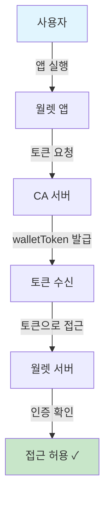

**📌 한줄 해석:** 우리은행 앱이 월렛에 접근하려면 CA 서버에서 walletToken을 발급받아야 하며, 이 토큰 발급 API를 우리 서버에 구현해야 합니다.

| 순서 | 단계 | 설명 |
|:---:|------|------|
| 1 | 앱 실행 | 사용자가 월렛 앱을 실행합니다 |
| 2 | 토큰 요청 | 앱이 CA 서버에 접근 토큰을 요청합니다 |
| 3 | 토큰 발급 | CA 서버가 walletToken을 발급합니다 |
| 4 | 월렛 접근 | 발급받은 토큰으로 월렛 서버에 접근합니다 |
| 5 | 접근 허용 | 토큰 검증 후 접근이 허용됩니다 |

---

## P102. 월렛 연결 해제

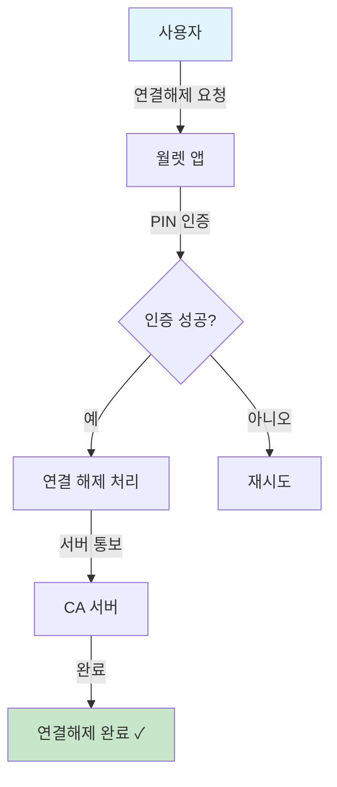

**📌 한줄 해석:** 사용자가 우리은행 앱과 월렛 연결을 해제하면 통보를 받는 API를 구현하여 우리 측 세션/토큰을 정리해야 합니다.

| 순서 | 단계 | 설명 |
|:---:|------|------|
| 1 | 연결해제 요청 | 사용자가 특정 CA앱 연결 해제를 요청합니다 |
| 2 | PIN 인증 | 본인 확인을 위해 PIN을 입력합니다 |
| 3 | 인증 확인 | PIN이 올바른지 확인합니다 |
| 4 | 연결 해제 | 해당 CA와의 연결을 끊습니다 |
| 5 | 서버 통보 | CA 서버에 연결 해제를 알립니다 |

---

## P103. 월렛 연결 해제 (CA앱 삭제)

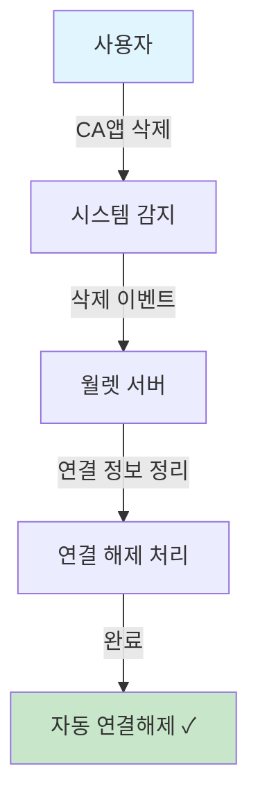

**📌 한줄 해석:** 사용자가 우리은행 앱을 삭제하면 월렛 서버가 자동 감지하여 연결을 해제하므로, 재설치 시 재연결 프로세스가 필요합니다.

| 순서 | 단계 | 설명 |
|:---:|------|------|
| 1 | CA앱 삭제 | 사용자가 연결된 CA앱을 삭제합니다 |
| 2 | 시스템 감지 | 운영체제가 앱 삭제를 감지합니다 |
| 3 | 서버 통보 | 월렛 서버에 삭제 이벤트가 전달됩니다 |
| 4 | 자동 해제 | 해당 CA와의 연결이 자동으로 정리됩니다 |

---

## P104. 월렛 삭제

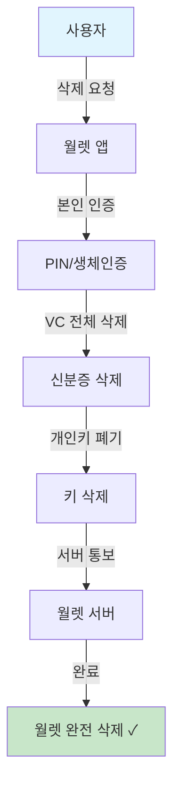

**📌 한줄 해석:** 월렛 삭제 시 우리은행 앱에서 발급한 VC도 함께 삭제되므로, 삭제 통보 수신 후 고객 상태를 '재발급 필요'로 갱신해야 합니다.

| 순서 | 단계 | 설명 |
|:---:|------|------|
| 1 | 삭제 요청 | 사용자가 월렛 삭제를 요청합니다 |
| 2 | 본인 인증 | PIN 또는 생체인증으로 본인을 확인합니다 |
| 3 | VC 삭제 | 저장된 모든 신분증(VC)을 삭제합니다 |
| 4 | 키 폐기 | 개인키를 안전하게 폐기합니다 |
| 5 | 서버 통보 | 월렛 서버에 삭제 완료를 알립니다 |

---

## P105. 연결 CA 목록 조회

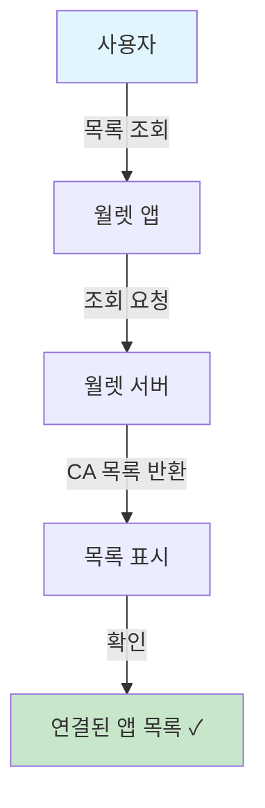

**📌 한줄 해석:** 우리은행 앱이 월렛에 정상 연결되어 있는지 사용자가 확인할 수 있으며, 연결 상태 문제 시 고객센터 안내가 필요합니다.

| 순서 | 단계 | 설명 |
|:---:|------|------|
| 1 | 목록 조회 | 사용자가 연결된 앱 목록을 요청합니다 |
| 2 | 서버 요청 | 월렛 서버에 목록을 요청합니다 |
| 3 | 목록 반환 | 연결된 CA 앱 정보가 반환됩니다 |
| 4 | 화면 표시 | 앱 이름, 연결 일시 등이 표시됩니다 |

---

## P106. 월렛 접근 사용

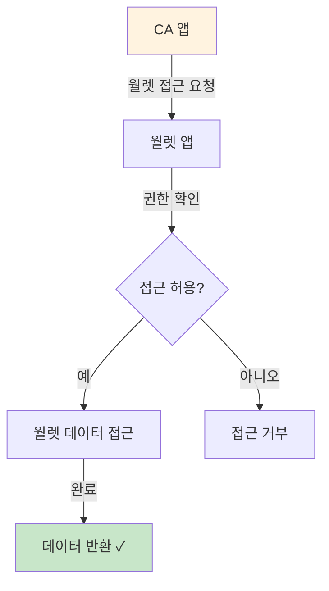

**📌 한줄 해석:** 우리은행 앱에서 월렛 데이터(VC 목록 등)에 접근할 때 호출하는 API로, 권한 범위 내에서만 데이터를 조회할 수 있습니다.

| 순서 | 단계 | 설명 |
|:---:|------|------|
| 1 | 접근 요청 | CA 앱이 월렛 데이터 접근을 요청합니다 |
| 2 | 권한 확인 | 해당 CA의 접근 권한을 확인합니다 |
| 3 | 허용/거부 | 권한에 따라 접근을 허용하거나 거부합니다 |
| 4 | 데이터 반환 | 허용 시 요청한 데이터를 반환합니다 |

---

## P107. 월렛 PIN 등록/변경

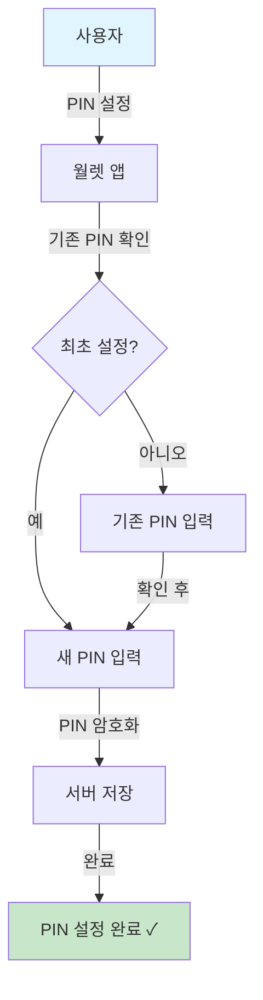

**📌 한줄 해석:** 월렛 PIN은 정부 앱에서 관리하며, 우리은행 앱은 PIN 설정을 직접 제어하지 않고 인증 결과만 수신합니다.

| 순서 | 단계 | 설명 |
|:---:|------|------|
| 1 | PIN 설정 시작 | 사용자가 PIN 설정 메뉴에 진입합니다 |
| 2 | 최초 여부 확인 | 처음 설정인지 변경인지 확인합니다 |
| 3 | 기존 PIN 확인 | 변경 시 기존 PIN을 먼저 입력합니다 |
| 4 | 새 PIN 입력 | 새로운 6자리 PIN을 입력합니다 |
| 5 | 암호화 저장 | PIN을 암호화하여 안전하게 저장합니다 |

---

## P108. 월렛 PIN 인증

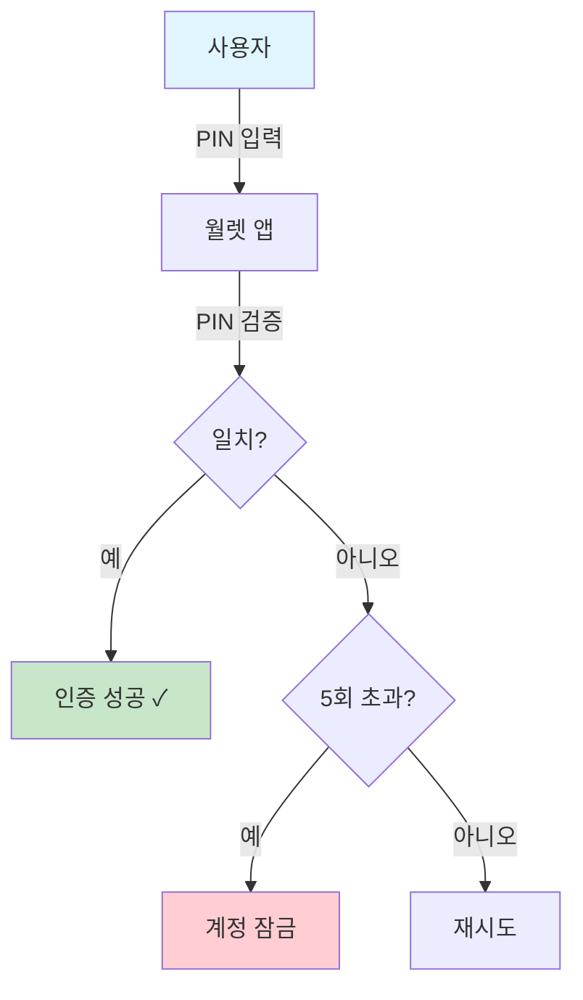

**📌 한줄 해석:** VP 제출 전 PIN 인증이 수행되며, 우리은행 앱은 인증 성공/실패 결과만 받아 처리합니다. 5회 실패 시 잠금 상태도 전달받습니다.

| 순서 | 단계 | 설명 |
|:---:|------|------|
| 1 | PIN 입력 | 사용자가 6자리 PIN을 입력합니다 |
| 2 | PIN 검증 | 저장된 PIN과 비교합니다 |
| 3 | 일치 확인 | 일치하면 인증 성공입니다 |
| 4 | 실패 횟수 | 불일치 시 실패 횟수를 확인합니다 |
| 5 | 잠금 처리 | 5회 초과 시 계정이 잠금됩니다 |

---

## P109. 인가 CA 검증

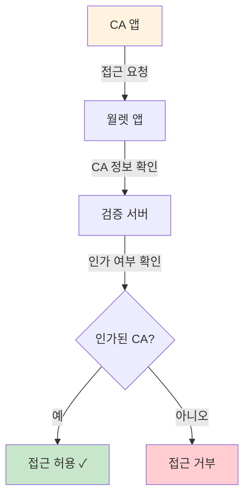

**📌 한줄 해석:** 우리은행이 정식 CA로 등록되어야 월렛 접근이 가능합니다. 사전에 정부기관에 CA 등록 및 인증서 발급이 필요합니다.

| 순서 | 단계 | 설명 |
|:---:|------|------|
| 1 | 접근 요청 | CA 앱이 월렛 접근을 요청합니다 |
| 2 | CA 정보 확인 | CA 앱의 인증서 정보를 확인합니다 |
| 3 | 서버 검증 | 검증 서버에서 인가 여부를 확인합니다 |
| 4 | 허용/거부 | 인가된 CA만 접근이 허용됩니다 |

---

## P110. 심카드 검증

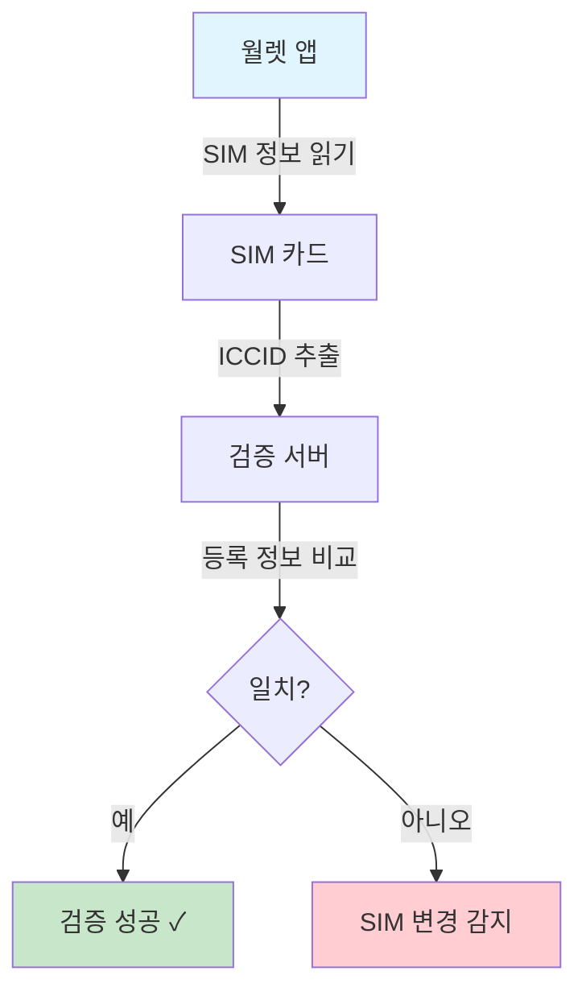

**📌 한줄 해석:** SIM 변경 시 추가 인증이 요구되며, 우리은행 앱에서 VP 요청 시 이 검증 결과에 따라 재인증이 필요할 수 있습니다.

| 순서 | 단계 | 설명 |
|:---:|------|------|
| 1 | SIM 정보 읽기 | 단말기의 SIM 카드 정보를 읽습니다 |
| 2 | ICCID 추출 | SIM 카드의 고유번호(ICCID)를 추출합니다 |
| 3 | 등록 정보 비교 | 최초 등록 시 저장된 정보와 비교합니다 |
| 4 | 결과 처리 | 불일치 시 추가 인증이 필요합니다 |

---

## P111. 인가 토큰

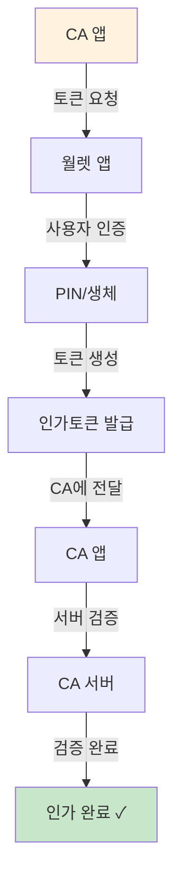

**📌 한줄 해석:** 우리은행 앱이 월렛에서 특정 작업(VP 생성 등)을 수행하려면 인가토큰을 요청해야 하며, 이 토큰을 우리 서버에서 검증합니다.

| 순서 | 단계 | 설명 |
|:---:|------|------|
| 1 | 토큰 요청 | CA 앱이 인가 토큰을 요청합니다 |
| 2 | 사용자 인증 | PIN 또는 생체인증으로 본인 확인합니다 |
| 3 | 토큰 생성 | 인가 토큰을 생성합니다 |
| 4 | CA 전달 | 생성된 토큰을 CA 앱에 전달합니다 |
| 5 | 서버 검증 | CA 서버에서 토큰을 검증합니다 |

---

## P112. 월렛 삭제 (Push)

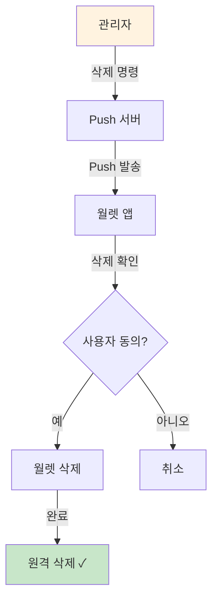

**📌 한줄 해석:** 분실/도난 신고 시 고객이 원격 삭제를 요청할 수 있으며, 삭제 후 우리은행 앱 연결도 해제되므로 고객 안내가 필요합니다.

| 순서 | 단계 | 설명 |
|:---:|------|------|
| 1 | 삭제 명령 | 관리자가 원격 삭제 명령을 내립니다 |
| 2 | Push 발송 | Push 서버가 단말기에 알림을 보냅니다 |
| 3 | 삭제 확인 | 사용자에게 삭제 동의를 요청합니다 |
| 4 | 동의/취소 | 사용자가 동의하면 삭제가 진행됩니다 |
| 5 | 삭제 완료 | 월렛이 완전히 삭제됩니다 |

---

## P113. 월렛 삭제 - 로컬 안면정보 변경 (Passive)

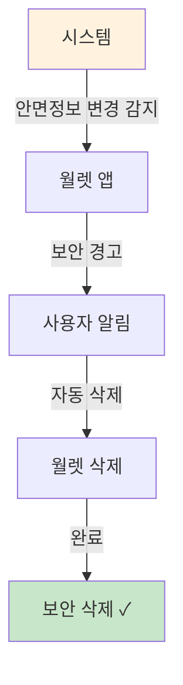

**📌 한줄 해석:** Face ID 변경 시 자동 삭제되므로, 우리은행 앱에서 "Face ID 변경 시 재등록 필요" 안내를 사전에 고객에게 공지해야 합니다.

| 순서 | 단계 | 설명 |
|:---:|------|------|
| 1 | 변경 감지 | 단말기 안면정보 변경을 감지합니다 |
| 2 | 보안 경고 | 사용자에게 보안 경고를 보냅니다 |
| 3 | 자동 삭제 | 별도 인증 없이 월렛이 삭제됩니다 |
| 4 | 완료 | 보안을 위한 자동 삭제가 완료됩니다 |

---

## P114. 월렛 삭제 - 로컬 안면정보 변경 (Active Exception)

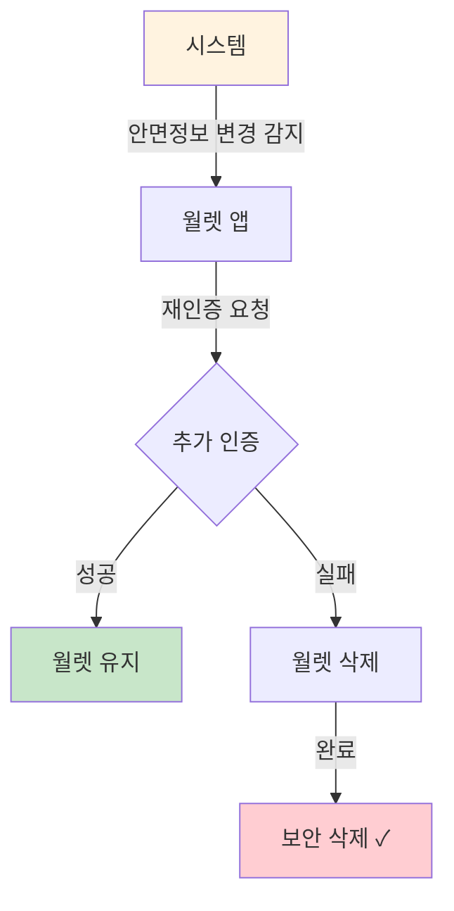

**📌 한줄 해석:** 안면정보 변경 시 추가 인증 기회가 주어지며, 우리은행 앱에서 이 상황 발생 시 고객센터 연결 안내를 제공해야 합니다.

| 순서 | 단계 | 설명 |
|:---:|------|------|
| 1 | 변경 감지 | 단말기 안면정보 변경을 감지합니다 |
| 2 | 재인증 요청 | 사용자에게 추가 인증을 요청합니다 |
| 3 | 인증 시도 | PIN 등으로 본인임을 증명합니다 |
| 4 | 결과 처리 | 성공 시 유지, 실패 시 삭제됩니다 |

---

## P115. 월렛 삭제 결과 통보

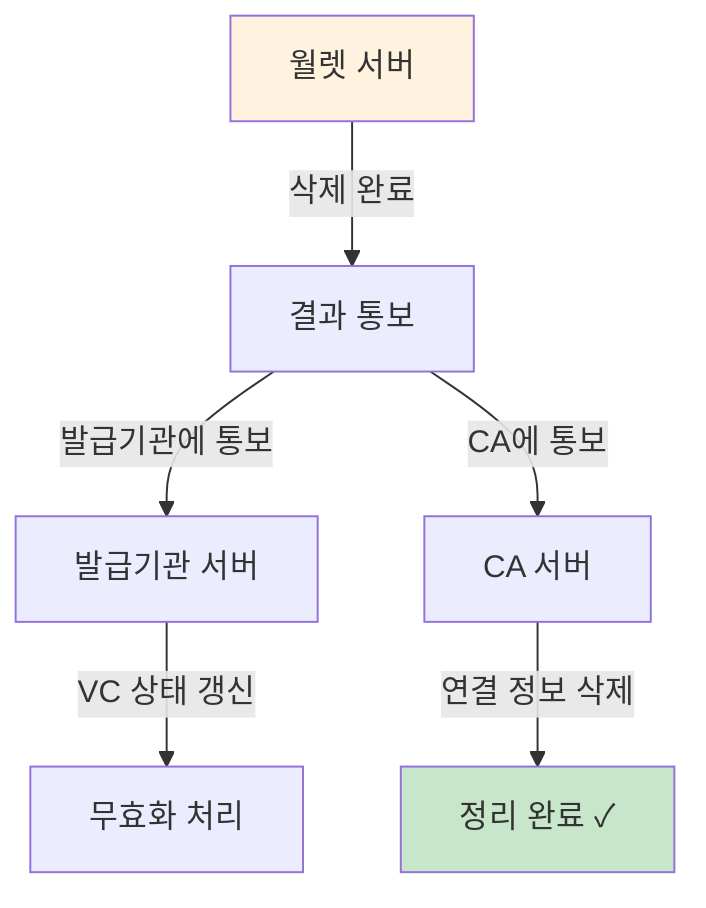

**📌 한줄 해석:** 월렛 삭제 시 우리은행 서버로 통보가 오므로, 이를 수신하는 Webhook/API를 구현하여 고객 상태를 갱신해야 합니다.

| 순서 | 단계 | 설명 |
|:---:|------|------|
| 1 | 삭제 완료 | 월렛 삭제가 완료됩니다 |
| 2 | 발급기관 통보 | VC 발급기관에 삭제를 알립니다 |
| 3 | CA 통보 | 연결된 CA 서버에 삭제를 알립니다 |
| 4 | 상태 갱신 | VC가 무효화 처리됩니다 |
| 5 | 정리 완료 | 모든 관련 정보가 정리됩니다 |

---

## P116. 월렛 연결해제 통보

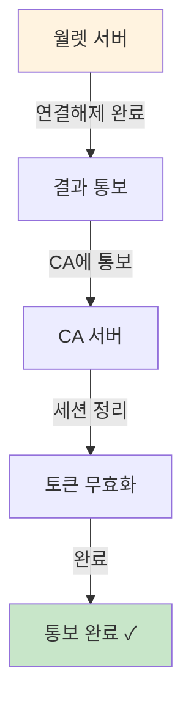

**📌 한줄 해석:** 연결 해제 통보 수신 시 우리은행 서버에서 해당 고객의 walletToken과 세션을 즉시 무효화해야 합니다.

| 순서 | 단계 | 설명 |
|:---:|------|------|
| 1 | 연결해제 완료 | 월렛 연결 해제가 완료됩니다 |
| 2 | CA 통보 | CA 서버에 해제 사실을 알립니다 |
| 3 | 세션 정리 | 기존 세션을 정리합니다 |
| 4 | 토큰 무효화 | 발급된 토큰을 무효화합니다 |

---

## P117. 월렛 연결 정리 (FW2CA) [Draft]

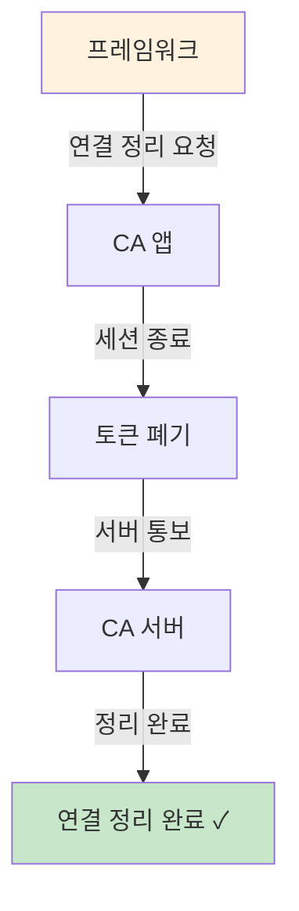

**📌 한줄 해석:** 프레임워크에서 우리은행 앱으로 연결 정리를 요청하는 프로세스로, 앱에서 이 이벤트를 수신하여 처리하는 로직이 필요합니다.

| 순서 | 단계 | 설명 |
|:---:|------|------|
| 1 | 정리 요청 | 프레임워크가 연결 정리를 요청합니다 |
| 2 | 세션 종료 | CA 앱의 세션을 종료합니다 |
| 3 | 토큰 폐기 | 발급된 토큰을 폐기합니다 |
| 4 | 서버 통보 | CA 서버에 정리 완료를 알립니다 |

> [!NOTE]
> 이 프로세스는 현재 Draft(초안) 상태입니다.
