# 2. 신원 인증 (P121~P151) - 12개

> **관점: 우리은행 모바일 신분증 CA 앱 개발**

---

## P121. 실명 인증 (도관 방식)

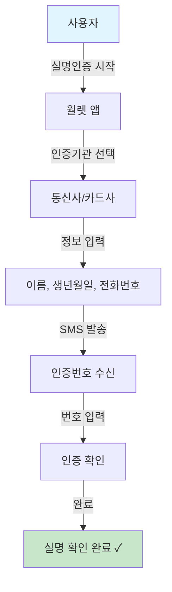

**📌 한줄 해석:** VC 발급 시 기존 통신사 인증을 활용하는 방식으로, 우리은행 앱에서 직접 구현할 필요 없이 월렛이 처리합니다.

| 순서 | 단계 | 설명 |
|:---:|------|------|
| 1 | 실명인증 시작 | 사용자가 실명인증을 시작합니다 |
| 2 | 인증기관 선택 | 통신사 또는 카드사를 선택합니다 |
| 3 | 정보 입력 | 이름, 생년월일, 전화번호를 입력합니다 |
| 4 | SMS 수신 | 인증번호가 포함된 SMS를 받습니다 |
| 5 | 인증 완료 | 인증번호 입력으로 본인 확인됩니다 |

---

## P123. 실명 인증 (직접 방식)

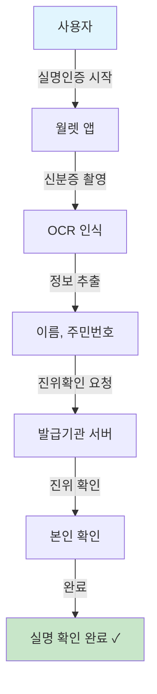

**📌 한줄 해석:** 신분증 OCR과 진위확인을 통한 실명인증으로, 우리은행이 발급기관으로서 진위확인 API를 제공할 수도 있습니다.

| 순서 | 단계 | 설명 |
|:---:|------|------|
| 1 | 실명인증 시작 | 사용자가 실명인증을 시작합니다 |
| 2 | 신분증 촬영 | 카메라로 신분증을 촬영합니다 |
| 3 | OCR 인식 | 신분증의 텍스트를 자동으로 인식합니다 |
| 4 | 정보 추출 | 이름, 주민번호 등 정보를 추출합니다 |
| 5 | 진위 확인 | 발급기관에서 신분증의 위조 여부를 확인합니다 |

---

## P130. IC카드 인증 (VC 발급용)

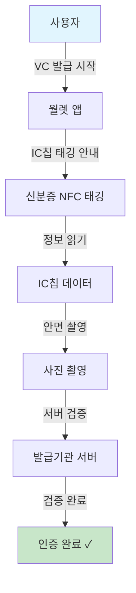

**📌 한줄 해석:** 고신뢰 인증 방식으로, 우리은행에서 VC 발급 시 이 인증 결과를 신뢰하여 추가 인증 없이 서비스를 제공할 수 있습니다.

| 순서 | 단계 | 설명 |
|:---:|------|------|
| 1 | VC 발급 시작 | 신분증 발급을 위해 인증을 시작합니다 |
| 2 | IC칩 태깅 | 스마트폰 뒷면에 신분증을 태깅합니다 |
| 3 | 정보 읽기 | NFC로 IC칩의 암호화된 정보를 읽습니다 |
| 4 | 안면 촬영 | 본인 확인을 위해 얼굴을 촬영합니다 |
| 5 | 서버 검증 | 발급기관에서 정보를 검증합니다 |

---

## P131. 발급 QR 인증 (VC 발급용)

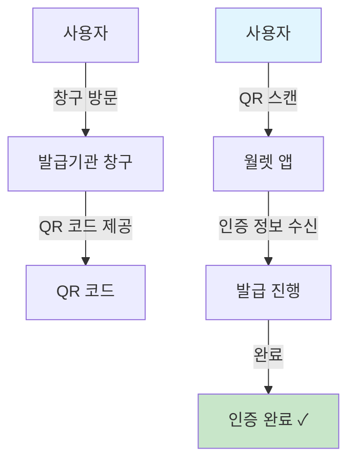

**📌 한줄 해석:** 우리은행 영업점에서 고객에게 QR을 제공하여 모바일 신분증 발급을 진행할 수 있는 대면 채널입니다.

| 순서 | 단계 | 설명 |
|:---:|------|------|
| 1 | 창구 방문 | 발급기관 창구를 방문합니다 |
| 2 | QR 제공 | 창구에서 발급용 QR 코드를 제공받습니다 |
| 3 | QR 스캔 | 월렛 앱으로 QR 코드를 스캔합니다 |
| 4 | 정보 수신 | 발급 인증 정보를 수신합니다 |
| 5 | 발급 진행 | 인증 완료 후 VC 발급이 진행됩니다 |

---

## P142-2. 로컬 기반 정부 안면인증 (VC 발급)

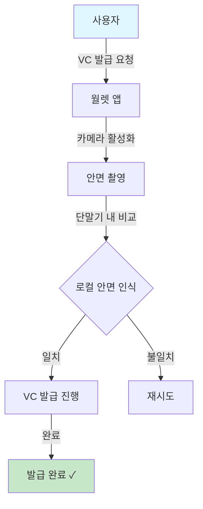

**📌 한줄 해석:** 얼굴 정보가 외부 전송되지 않아 프라이버시가 보호되며, 우리은행 앱에서 이 인증 방식 선호 여부를 고객에게 안내할 수 있습니다.

| 순서 | 단계 | 설명 |
|:---:|------|------|
| 1 | VC 발급 요청 | 사용자가 신분증 발급을 요청합니다 |
| 2 | 카메라 활성화 | 전면 카메라가 활성화됩니다 |
| 3 | 안면 촬영 | 사용자의 얼굴을 촬영합니다 |
| 4 | 로컬 비교 | 단말기 내에서 등록된 얼굴과 비교합니다 |
| 5 | 발급 진행 | 일치 시 VC 발급이 진행됩니다 |

---

## P142-3. 서버 기반 정부 안면인증 (VC 발급)

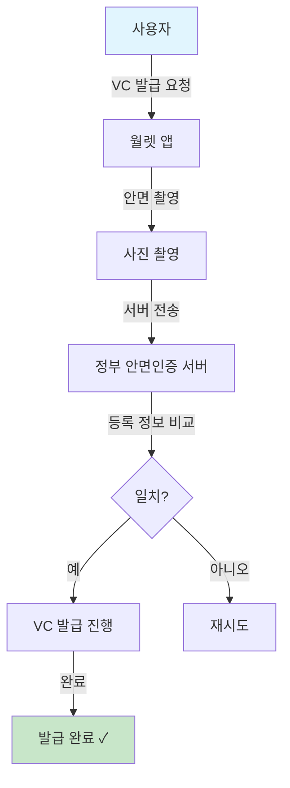

**📌 한줄 해석:** 정부 DB와 비교하는 고신뢰 인증으로, 우리은행 비대면 계좌개설 등 고위험 거래에 이 인증 결과를 활용할 수 있습니다.

| 순서 | 단계 | 설명 |
|:---:|------|------|
| 1 | VC 발급 요청 | 사용자가 신분증 발급을 요청합니다 |
| 2 | 안면 촬영 | 사용자의 얼굴을 촬영합니다 |
| 3 | 서버 전송 | 촬영된 얼굴을 정부 서버로 전송합니다 |
| 4 | 정보 비교 | 정부 DB의 등록 사진과 비교합니다 |
| 5 | 발급 진행 | 일치 시 VC 발급이 진행됩니다 |

---

## P142-4. 로컬 기반 정부 안면인증 (2nd CA 등록)

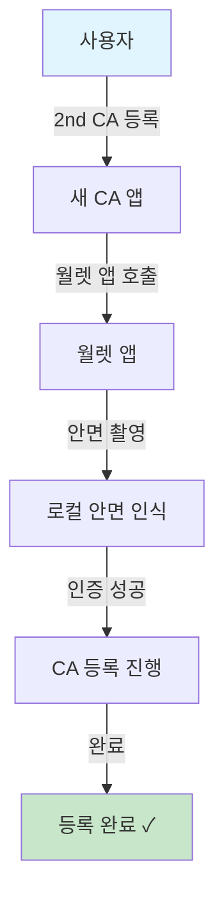

**📌 한줄 해석:** 고객이 이미 다른 앱에 월렛을 연결한 경우, 우리은행 앱 등록 시 로컬 안면인증으로 빠르게 연결할 수 있습니다.

| 순서 | 단계 | 설명 |
|:---:|------|------|
| 1 | 2nd CA 등록 | 새로운 CA 앱에 등록을 시작합니다 |
| 2 | 월렛 앱 호출 | 새 앱이 월렛 앱을 호출합니다 |
| 3 | 안면 촬영 | 본인 확인을 위해 얼굴을 촬영합니다 |
| 4 | 로컬 인증 | 단말기 내에서 안면 인증합니다 |
| 5 | 등록 완료 | 새 CA 앱 등록이 완료됩니다 |

---

## P142-5. 서버 기반 정부 안면인증 (2nd CA 등록)

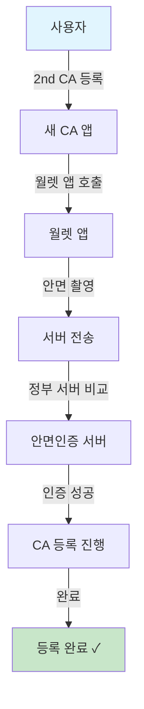

**📌 한줄 해석:** 우리은행 앱 등록 시 정부 서버 안면인증을 요구하여 더 높은 보안 수준으로 고객을 등록할 수 있습니다.

| 순서 | 단계 | 설명 |
|:---:|------|------|
| 1 | 2nd CA 등록 | 새로운 CA 앱에 등록을 시작합니다 |
| 2 | 월렛 앱 호출 | 새 앱이 월렛 앱을 호출합니다 |
| 3 | 안면 촬영 | 본인 확인을 위해 얼굴을 촬영합니다 |
| 4 | 서버 전송 | 정부 서버로 사진을 전송합니다 |
| 5 | 서버 인증 | 정부 DB와 비교하여 인증합니다 |
| 6 | 등록 완료 | 새 CA 앱 등록이 완료됩니다 |

---

## P143. 단말 안면인증

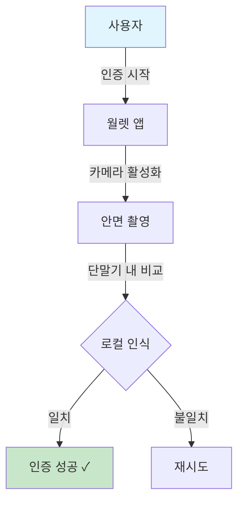

**📌 한줄 해석:** Face ID를 활용한 빠른 인증으로, 우리은행 앱에서 VP 제출 전 본인확인에 활용할 수 있습니다.

| 순서 | 단계 | 설명 |
|:---:|------|------|
| 1 | 인증 시작 | 안면 인증을 시작합니다 |
| 2 | 카메라 활성화 | 전면 카메라가 활성화됩니다 |
| 3 | 안면 촬영 | 사용자의 얼굴을 촬영합니다 |
| 4 | 로컬 비교 | 스마트폰에 저장된 얼굴과 비교합니다 |
| 5 | 결과 처리 | 일치하면 인증 성공입니다 |

---

## P144. 서버 안면인증

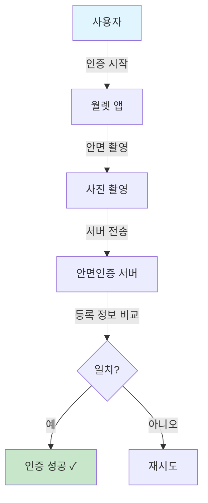

**📌 한줄 해석:** 고액 이체 등 고위험 거래 시 서버 안면인증을 요구하여 추가 보안을 제공할 수 있습니다.

| 순서 | 단계 | 설명 |
|:---:|------|------|
| 1 | 인증 시작 | 서버 안면 인증을 시작합니다 |
| 2 | 안면 촬영 | 사용자의 얼굴을 촬영합니다 |
| 3 | 서버 전송 | 촬영된 사진을 서버로 전송합니다 |
| 4 | 정보 비교 | 서버의 등록 정보와 비교합니다 |
| 5 | 결과 처리 | 일치하면 인증 성공입니다 |

---

## P150. 지문인증 상태변경 - Suspend (Passive)

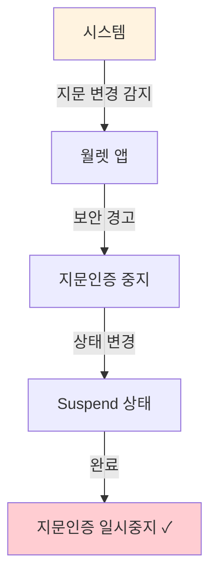

**📌 한줄 해석:** 지문 변경 시 인증이 중지되므로, 우리은행 앱에서 거래 시도 시 "지문인증 재설정 필요" 안내를 표시해야 합니다.

| 순서 | 단계 | 설명 |
|:---:|------|------|
| 1 | 지문 변경 감지 | 단말기 지문 정보 변경을 감지합니다 |
| 2 | 보안 경고 | 사용자에게 보안 경고를 보냅니다 |
| 3 | 인증 중지 | 지문 인증 기능을 중지합니다 |
| 4 | Suspend 상태 | 일시중지 상태로 변경됩니다 |

---

## P151. 지문인증 상태변경 - Resume

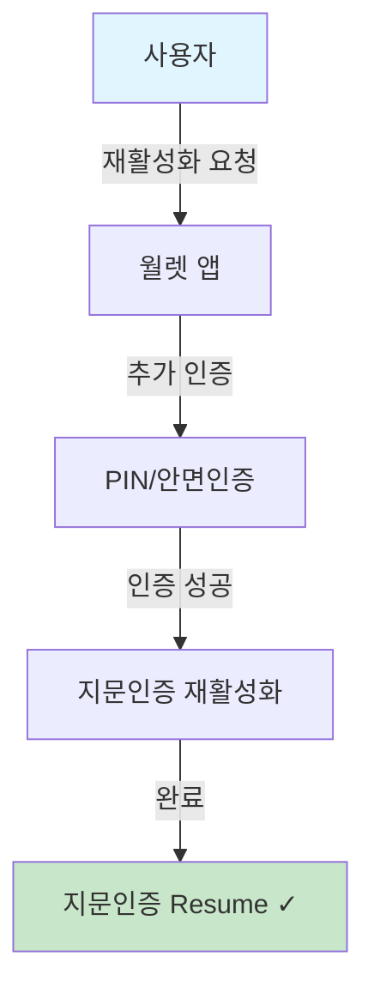

**📌 한줄 해석:** 지문인증 재활성화 후 우리은행 앱에서 정상적인 거래가 가능하며, 이 상태 변경을 앱에서 감지할 수 있습니다.

| 순서 | 단계 | 설명 |
|:---:|------|------|
| 1 | 재활성화 요청 | 사용자가 지문인증 재활성화를 요청합니다 |
| 2 | 추가 인증 | PIN 또는 안면인증으로 본인을 확인합니다 |
| 3 | 인증 성공 | 추가 인증이 성공합니다 |
| 4 | 재활성화 | 지문인증이 다시 활성화됩니다 |
