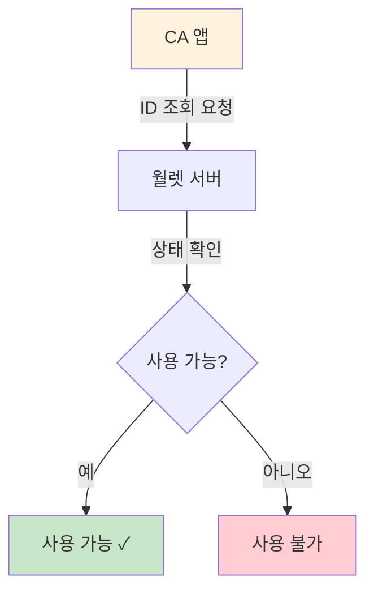
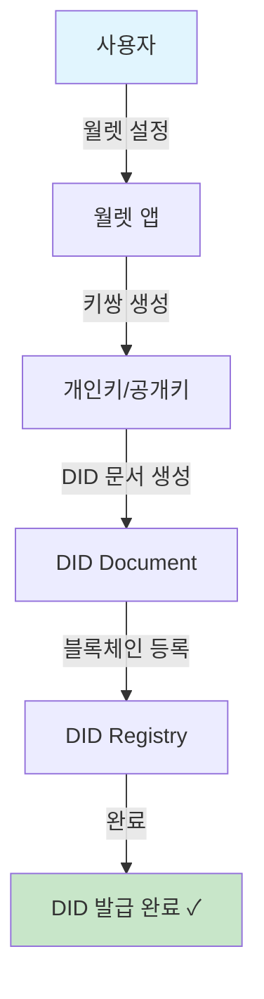
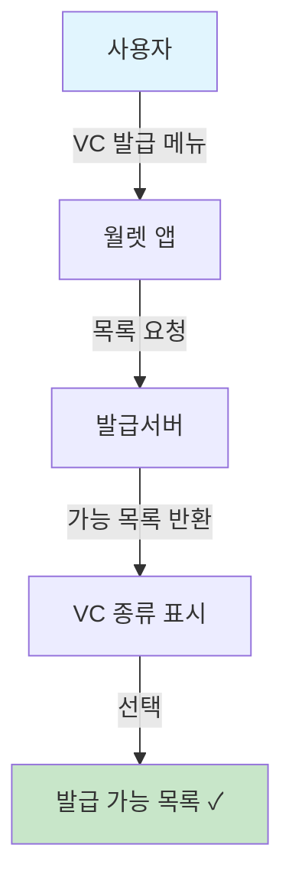
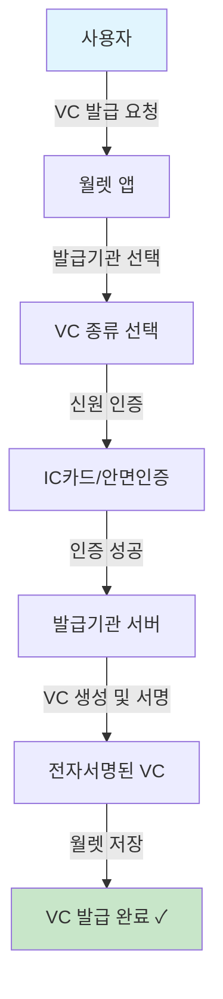
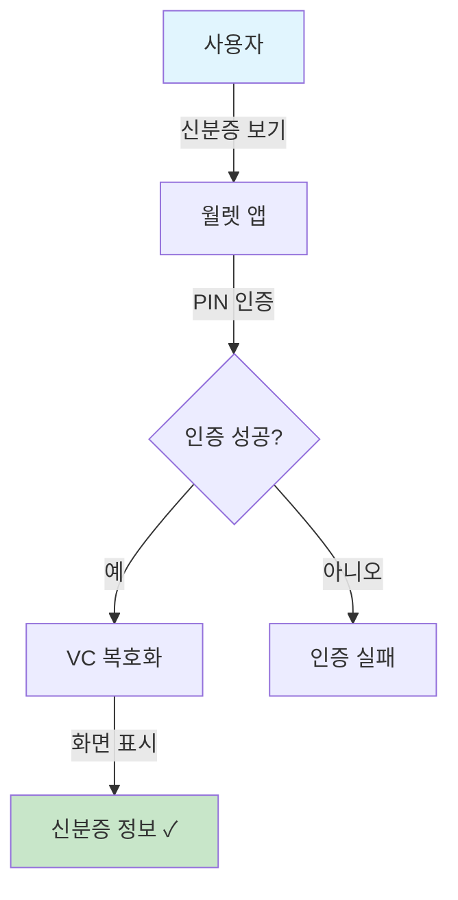
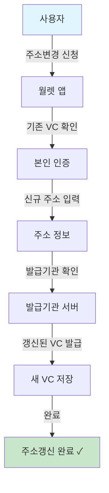
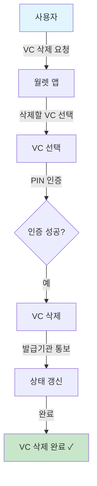
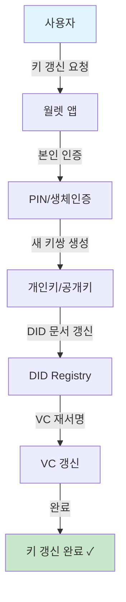
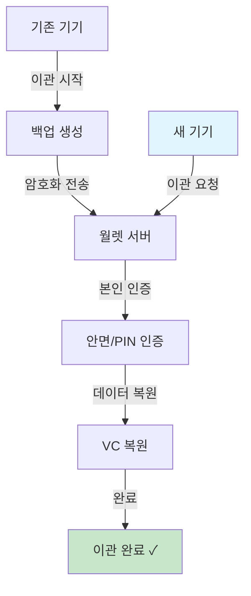
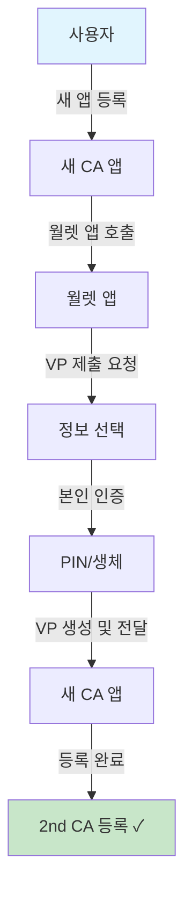

# 3. VC 관리 (P190~P290) - 10개

> **관점: 우리은행 모바일 신분증 CA 앱 개발**

---

## P190. walletId 사용가능 여부 조회

**📌 한줄 해석:** 우리은행 앱에서 거래 전 고객의 walletId 유효성을 확인하는 API로, 삭제/정지된 월렛은 사용 불가 상태로 반환됩니다.

| 순서 | 단계 | 설명 |
|:---:|------|------|
| 1 | ID 조회 요청 | CA 앱이 walletId 상태를 조회합니다 |
| 2 | 상태 확인 | 월렛 서버에서 ID 상태를 확인합니다 |
| 3 | 결과 반환 | 사용 가능 여부를 반환합니다 |
| 4 | 처리 진행 | 결과에 따라 다음 처리를 진행합니다 |

---

## P200. DID 발급

**📌 한줄 해석:** DID는 월렛에서 자동 생성되며, 우리은행 앱은 이 DID를 기반으로 고객을 식별하고 VP 검증에 활용합니다.

| 순서 | 단계 | 설명 |
|:---:|------|------|
| 1 | 월렛 설정 | 월렛 앱 최초 설정을 시작합니다 |
| 2 | 키쌍 생성 | 개인키와 공개키 쌍을 생성합니다 |
| 3 | DID 문서 생성 | DID Document를 생성합니다 |
| 4 | 블록체인 등록 | DID를 블록체인에 등록합니다 |
| 5 | 발급 완료 | 고유한 DID가 발급됩니다 |

---

## P210. 발급 가능 VC 리스트 조회

**📌 한줄 해석:** 우리은행이 발급기관으로 등록되면 이 목록에 "우리은행 직원증" 등 자체 VC가 표시될 수 있습니다.

| 순서 | 단계 | 설명 |
|:---:|------|------|
| 1 | VC 발급 메뉴 | 사용자가 VC 발급 메뉴에 진입합니다 |
| 2 | 목록 요청 | 발급 서버에 목록을 요청합니다 |
| 3 | 목록 반환 | 발급 가능한 VC 종류가 반환됩니다 |
| 4 | 화면 표시 | 주민등록증, 운전면허증 등이 표시됩니다 |

---

## P211. VC 발급

**📌 한줄 해석:** 우리은행이 발급기관 역할 시 VC 발급 API를 구현해야 하며, 발급된 VC에 우리은행 전자서명을 포함합니다.

| 순서 | 단계 | 설명 |
|:---:|------|------|
| 1 | 발급 요청 | 사용자가 VC 발급을 요청합니다 |
| 2 | VC 종류 선택 | 발급받을 신분증 종류를 선택합니다 |
| 3 | 신원 인증 | IC카드 또는 안면인증으로 본인을 확인합니다 |
| 4 | 인증 성공 | 인증이 성공적으로 완료됩니다 |
| 5 | VC 생성 | 발급기관에서 VC를 생성하고 서명합니다 |
| 6 | 월렛 저장 | 발급된 VC가 월렛에 저장됩니다 |

---

## P220. VC 정보 표시

**📌 한줄 해석:** 우리은행 앱에서 VC 정보 조회 API를 호출하면 허용된 항목만 반환되며, 민감 정보 접근은 제한됩니다.

| 순서 | 단계 | 설명 |
|:---:|------|------|
| 1 | 신분증 보기 | 사용자가 신분증 보기를 요청합니다 |
| 2 | PIN 인증 | 본인 확인을 위해 PIN을 입력합니다 |
| 3 | 인증 확인 | PIN이 올바른지 확인합니다 |
| 4 | VC 복호화 | 암호화된 VC를 복호화합니다 |
| 5 | 정보 표시 | 신분증 정보가 화면에 표시됩니다 |

---

## P230. 주소갱신 VC 발급

**📌 한줄 해석:** 고객 주소 변경 시 VP의 주소 정보도 갱신되므로, 우리은행 앱에서 주소 확인 시 항상 최신 정보를 받게 됩니다.

| 순서 | 단계 | 설명 |
|:---:|------|------|
| 1 | 주소변경 신청 | 사용자가 주소 갱신을 신청합니다 |
| 2 | 기존 VC 확인 | 기존 VC의 유효성을 확인합니다 |
| 3 | 본인 인증 | 본인 확인 인증을 수행합니다 |
| 4 | 주소 입력 | 새로운 주소 정보를 입력합니다 |
| 5 | 발급기관 확인 | 발급기관에서 정보를 확인합니다 |
| 6 | 갱신 완료 | 새 주소가 반영된 VC가 발급됩니다 |

---

## P240. VC 삭제

**📌 한줄 해석:** VC 삭제 시 우리은행이 발급기관이면 삭제 통보를 받으며, 검증기관이면 해당 고객의 VP가 더 이상 유효하지 않습니다.

| 순서 | 단계 | 설명 |
|:---:|------|------|
| 1 | 삭제 요청 | 사용자가 VC 삭제를 요청합니다 |
| 2 | VC 선택 | 삭제할 VC를 선택합니다 |
| 3 | PIN 인증 | 본인 확인을 위해 PIN을 입력합니다 |
| 4 | VC 삭제 | 선택한 VC를 삭제합니다 |
| 5 | 발급기관 통보 | 발급기관에 삭제를 알립니다 |
| 6 | 상태 갱신 | VC 상태가 삭제로 갱신됩니다 |

---

## P250. Holder 개인키 갱신

**📌 한줄 해석:** 키 갱신 후에도 기존 VP 검증이 정상 작동하도록 DID Resolver를 통해 최신 공개키를 조회해야 합니다.

| 순서 | 단계 | 설명 |
|:---:|------|------|
| 1 | 키 갱신 요청 | 사용자가 개인키 갱신을 요청합니다 |
| 2 | 본인 인증 | PIN 또는 생체인증으로 본인을 확인합니다 |
| 3 | 새 키쌍 생성 | 새로운 개인키/공개키 쌍을 생성합니다 |
| 4 | DID 갱신 | DID 문서를 새 공개키로 갱신합니다 |
| 5 | VC 재서명 | 기존 VC를 새 키로 재서명합니다 |
| 6 | 갱신 완료 | 키 갱신이 완료됩니다 |

---

## P260. 정부앱 지갑 이관 [Draft]

**📌 한줄 해석:** 기기 변경 시 기존 연결이 유지되므로, 우리은행 앱에서 이관 완료 후 별도 재등록 없이 서비스 이용이 가능합니다.

| 순서 | 단계 | 설명 |
|:---:|------|------|
| 1 | 이관 시작 | 기존 기기에서 이관을 시작합니다 |
| 2 | 백업 생성 | 월렛 데이터를 암호화하여 백업합니다 |
| 3 | 서버 전송 | 암호화된 데이터를 서버로 전송합니다 |
| 4 | 새 기기 요청 | 새 기기에서 이관을 요청합니다 |
| 5 | 본인 인증 | 안면 또는 PIN으로 본인을 확인합니다 |
| 6 | 데이터 복원 | VC 등 데이터가 새 기기에 복원됩니다 |

---

## P290. 2nd CA 등록 (VP 기반 App2App)

**📌 한줄 해석:** 고객이 우리은행 앱을 처음 설치하면 이 프로세스로 등록하며, VP 검증 후 고객 정보를 받아 계정을 생성합니다.

| 순서 | 단계 | 설명 |
|:---:|------|------|
| 1 | 새 앱 등록 | 새로운 CA 앱에 등록을 시작합니다 |
| 2 | 월렛 앱 호출 | 새 앱이 월렛 앱을 호출합니다 |
| 3 | VP 요청 | 본인 확인을 위한 VP를 요청합니다 |
| 4 | 정보 선택 | 제출할 정보를 선택합니다 |
| 5 | 본인 인증 | PIN 또는 생체인증으로 확인합니다 |
| 6 | VP 전달 | 생성된 VP를 새 앱에 전달합니다 |
| 7 | 등록 완료 | 새 CA 앱 등록이 완료됩니다 |
