# 4. VP 제출 (P311~P315) - 13개

> **관점: 우리은행 모바일 신분증 CA 앱 개발**

---

## P311-1. QR-MPM Direct Mode (VP)

**📌 한줄 해석:** 우리은행 영업점/ATM에서 QR을 표시하고 고객이 스캔하면 VP를 직접 수신하여 본인확인을 완료하는 방식입니다.

| 순서 | 단계 | 설명 |
|:---:|------|------|
| 1 | QR 표시 | 가맹점이 화면에 QR 코드를 표시합니다 |
| 2 | QR 스캔 | 사용자가 월렛 앱으로 QR을 스캔합니다 |
| 3 | 정보 확인 | 요청하는 정보를 확인합니다 |
| 4 | 항목 선택 | 제출할 항목을 선택합니다 |
| 5 | PIN 인증 | PIN으로 본인을 확인합니다 |
| 6 | VP 생성 | VP를 생성합니다 |
| 7 | 직접 전송 | 검증기관 서버로 직접 전송합니다 |

---

## P311-2. QR-MPM Direct Mode (ZKP)

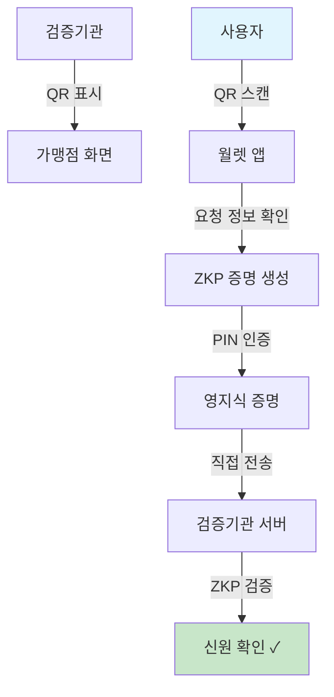

**📌 한줄 해석:** 주민번호 노출 없이 "성인 여부"만 확인하는 ZKP 방식으로, 우리은행 ATM 성인인증 등에 활용할 수 있습니다.

| 순서 | 단계 | 설명 |
|:---:|------|------|
| 1 | QR 표시 | 가맹점이 QR 코드를 표시합니다 |
| 2 | QR 스캔 | 사용자가 QR을 스캔합니다 |
| 3 | 요청 확인 | 증명이 필요한 조건을 확인합니다 |
| 4 | ZKP 생성 | 영지식 증명을 생성합니다 (예: 19세 이상) |
| 5 | PIN 인증 | PIN으로 본인을 확인합니다 |
| 6 | 직접 전송 | 검증기관 서버로 전송합니다 |
| 7 | 검증 완료 | 조건만 확인되고 세부정보는 노출되지 않습니다 |

---

## P311-3. QR-MPM Direct Mode (Signature+VP)

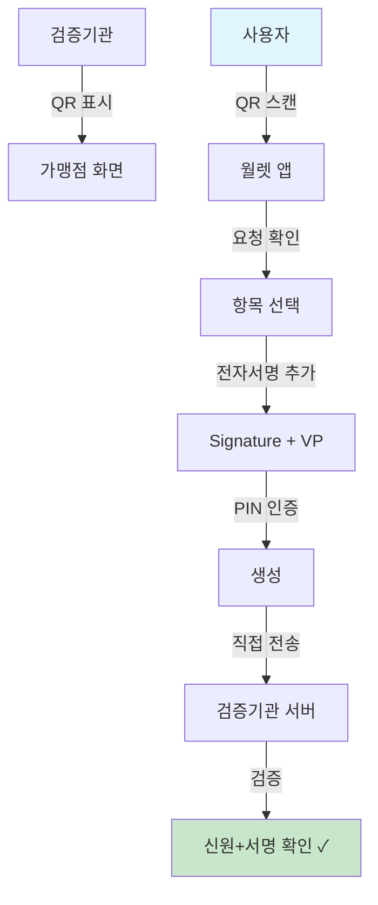

**📌 한줄 해석:** 전자서명이 포함되어 법적 효력이 있으며, 우리은행 대출 약정/계좌 개설 동의에 활용할 수 있습니다.

| 순서 | 단계 | 설명 |
|:---:|------|------|
| 1 | QR 표시 | 가맹점이 QR 코드를 표시합니다 |
| 2 | QR 스캔 | 사용자가 QR을 스캔합니다 |
| 3 | 요청 확인 | 서명이 필요한 내용을 확인합니다 |
| 4 | 항목 선택 | 제출할 정보를 선택합니다 |
| 5 | 서명 추가 | 전자서명을 추가합니다 |
| 6 | VP 생성 | Signature + VP를 생성합니다 |
| 7 | 검증 완료 | 신원과 서명이 함께 확인됩니다 |

---

## P312-1. QR-CPM Proxy Mode (VP)

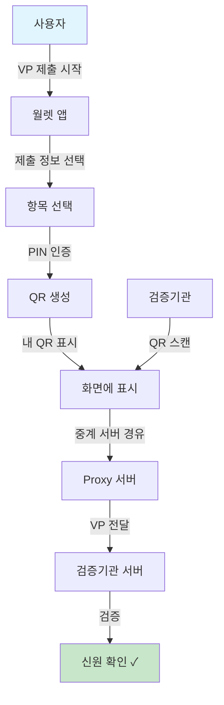

**📌 한줄 해석:** 고객이 QR을 보여주면 우리은행 직원이 스캔하는 방식으로, 창구 본인확인에 적합합니다.

| 순서 | 단계 | 설명 |
|:---:|------|------|
| 1 | VP 제출 시작 | 사용자가 VP 제출을 시작합니다 |
| 2 | 정보 선택 | 제출할 정보를 선택합니다 |
| 3 | PIN 인증 | PIN으로 본인을 확인합니다 |
| 4 | QR 생성 | VP가 담긴 QR 코드를 생성합니다 |
| 5 | QR 표시 | 화면에 QR 코드를 표시합니다 |
| 6 | QR 스캔 | 가맹점이 QR을 스캔합니다 |
| 7 | Proxy 경유 | 중계 서버를 통해 VP가 전달됩니다 |

---

## P312-2. QR-CPM Proxy Mode (ZKP)

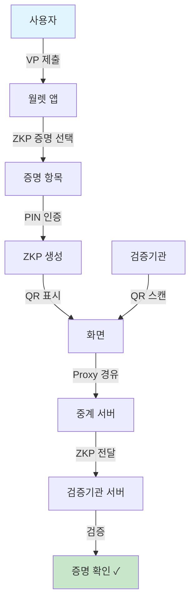

**📌 한줄 해석:** 최소한의 정보만 공개하는 ZKP를 QR로 제시하여 프라이버시를 보호하면서 본인확인합니다.

| 순서 | 단계 | 설명 |
|:---:|------|------|
| 1 | VP 제출 | 사용자가 제출을 시작합니다 |
| 2 | 증명 선택 | 증명할 조건을 선택합니다 |
| 3 | PIN 인증 | PIN으로 본인을 확인합니다 |
| 4 | ZKP 생성 | 영지식 증명을 생성합니다 |
| 5 | QR 표시 | ZKP가 담긴 QR을 표시합니다 |
| 6 | Proxy 경유 | 중계 서버를 통해 전달됩니다 |

---

## P312-3. QR-CPM Proxy Direct Mode (VP)

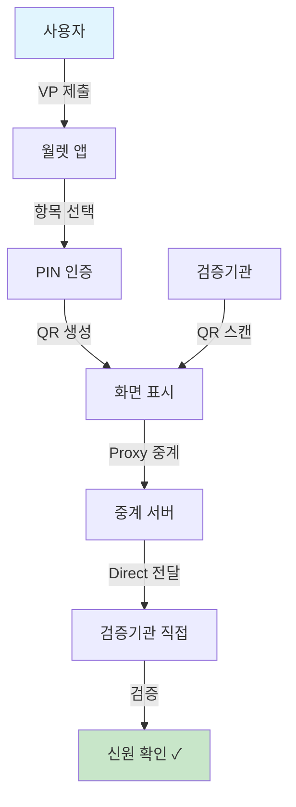

**📌 한줄 해석:** Proxy를 거치되 최종적으로 우리은행 서버에 직접 연결되어 보안과 속도를 모두 확보합니다.

| 순서 | 단계 | 설명 |
|:---:|------|------|
| 1 | VP 제출 | 사용자가 제출을 시작합니다 |
| 2 | 항목 선택 | 제출할 정보를 선택합니다 |
| 3 | PIN 인증 | PIN으로 본인을 확인합니다 |
| 4 | QR 생성 | QR 코드를 생성하고 표시합니다 |
| 5 | QR 스캔 | 검증기관이 QR을 스캔합니다 |
| 6 | Proxy 경유 | 중계 서버를 거칩니다 |
| 7 | Direct 전달 | 검증기관 서버로 직접 전달됩니다 |

---

## P312-4. QR-CPM Proxy Direct Mode (ZKP)

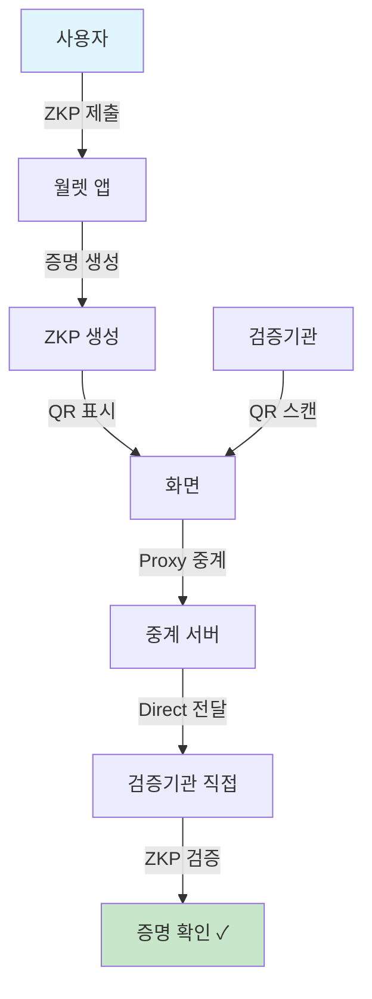

**📌 한줄 해석:** ZKP의 프라이버시 장점과 Direct 연결의 보안성을 결합한 방식입니다.

| 순서 | 단계 | 설명 |
|:---:|------|------|
| 1 | ZKP 제출 | 사용자가 ZKP 제출을 시작합니다 |
| 2 | 증명 생성 | 영지식 증명을 생성합니다 |
| 3 | QR 표시 | QR 코드를 화면에 표시합니다 |
| 4 | QR 스캔 | 검증기관이 QR을 스캔합니다 |
| 5 | Proxy 경유 | 중계 서버를 거칩니다 |
| 6 | Direct 전달 | 검증기관에 직접 전달됩니다 |

---

## P313-1. PUSH Direct Mode (VP)

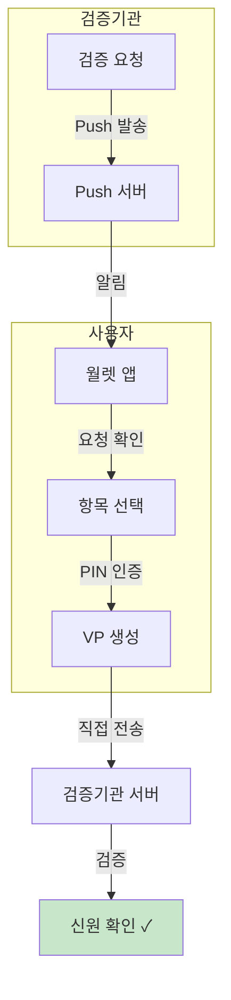

**📌 한줄 해석:** 우리은행 앱/인터넷뱅킹에서 본인확인이 필요할 때 푸시로 요청하고 VP를 직접 수신하는 비대면 방식입니다.

| 순서 | 단계 | 설명 |
|:---:|------|------|
| 1 | 검증 요청 | 검증기관이 신원확인을 요청합니다 |
| 2 | Push 발송 | Push 서버가 사용자에게 알림을 보냅니다 |
| 3 | 알림 수신 | 사용자가 월렛 앱에서 알림을 확인합니다 |
| 4 | 항목 선택 | 제출할 정보를 선택합니다 |
| 5 | PIN 인증 | PIN으로 본인을 확인합니다 |
| 6 | VP 직접 전송 | 검증기관 서버로 직접 전송합니다 |

---

## P313-2. PUSH Direct Mode (Signature+VP)

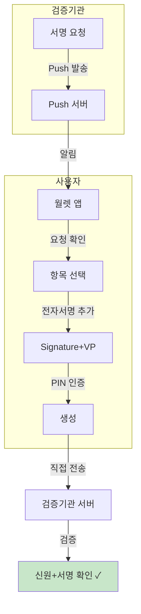

**📌 한줄 해석:** 비대면 대출 약정 등 전자서명이 필요한 업무에서 푸시로 서명을 요청하고 VP+서명을 수신합니다.

| 순서 | 단계 | 설명 |
|:---:|------|------|
| 1 | 서명 요청 | 검증기관이 전자서명을 요청합니다 |
| 2 | Push 발송 | 사용자에게 알림이 전송됩니다 |
| 3 | 알림 확인 | 사용자가 요청 내용을 확인합니다 |
| 4 | 항목 선택 | 제출할 정보를 선택합니다 |
| 5 | 서명 추가 | 전자서명을 VP에 추가합니다 |
| 6 | 직접 전송 | 검증기관에 직접 전송합니다 |

---

## P314-1. APP2APP Indirect Mode (VP)

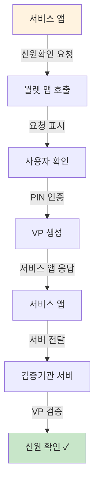

**📌 한줄 해석:** 우리은행 앱에서 월렛을 호출하여 VP를 받고, 이를 우리 서버로 전달하여 검증하는 기본 연동 방식입니다.

| 순서 | 단계 | 설명 |
|:---:|------|------|
| 1 | 신원확인 요청 | 서비스 앱이 신원확인을 요청합니다 |
| 2 | 월렛 호출 | 서비스 앱이 월렛 앱을 호출합니다 |
| 3 | 요청 확인 | 사용자가 요청 내용을 확인합니다 |
| 4 | PIN 인증 | PIN으로 본인을 확인합니다 |
| 5 | VP 생성 | VP를 생성합니다 |
| 6 | 앱 응답 | 서비스 앱에 VP를 반환합니다 |
| 7 | 서버 전달 | 서비스 앱이 서버로 VP를 전달합니다 |

---

## P314-2. APP2APP Direct Mode

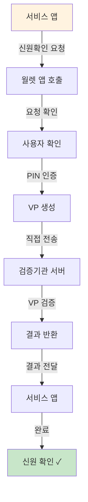

**📌 한줄 해석:** VP가 우리은행 서버로 직접 전송되어 앱에서 VP가 노출되지 않으므로 보안이 강화됩니다.

| 순서 | 단계 | 설명 |
|:---:|------|------|
| 1 | 신원확인 요청 | 서비스 앱이 요청합니다 |
| 2 | 월렛 호출 | 월렛 앱이 호출됩니다 |
| 3 | 요청 확인 | 사용자가 요청을 확인합니다 |
| 4 | PIN 인증 | PIN으로 본인을 확인합니다 |
| 5 | 직접 전송 | VP를 검증기관에 직접 전송합니다 |
| 6 | 결과 반환 | 검증 결과가 반환됩니다 |
| 7 | 앱 전달 | 서비스 앱에 결과가 전달됩니다 |

---

## P314-3. APP2APP Indirect Mode (Signature+VP)

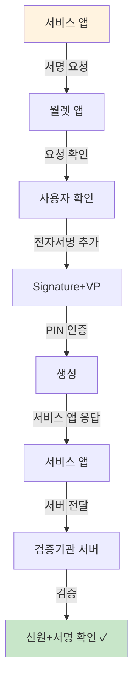

**📌 한줄 해석:** 앱 내에서 전자서명 동의를 받아 우리 서버로 전달하는 방식으로, 약관 동의 등에 활용합니다.

| 순서 | 단계 | 설명 |
|:---:|------|------|
| 1 | 서명 요청 | 서비스 앱이 전자서명을 요청합니다 |
| 2 | 월렛 호출 | 월렛 앱이 호출됩니다 |
| 3 | 요청 확인 | 서명할 내용을 확인합니다 |
| 4 | 서명 추가 | 전자서명을 추가합니다 |
| 5 | VP 생성 | Signature+VP를 생성합니다 |
| 6 | 앱 응답 | 서비스 앱에 응답합니다 |
| 7 | 서버 검증 | 서버에서 검증합니다 |

---

## P314-4. APP2APP Direct Mode (Signature+VP)

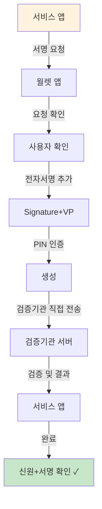

**📌 한줄 해석:** 가장 보안이 강화된 방식으로, 서명+VP가 우리 서버로 직접 전송되어 대출/계약에 적합합니다.

| 순서 | 단계 | 설명 |
|:---:|------|------|
| 1 | 서명 요청 | 서비스 앱이 요청합니다 |
| 2 | 요청 확인 | 서명할 내용을 확인합니다 |
| 3 | 서명 추가 | 전자서명을 추가합니다 |
| 4 | VP 생성 | Signature+VP를 생성합니다 |
| 5 | 직접 전송 | 검증기관에 직접 전송합니다 |
| 6 | 결과 반환 | 결과가 서비스 앱에 전달됩니다 |

---

## P315-1. NFC Indirect Mode (VP)

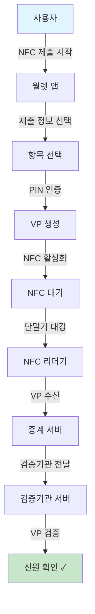

**📌 한줄 해석:** 우리은행 ATM이나 창구에 NFC 리더기를 설치하면 고객이 폰을 태깅하여 빠르게 본인확인 가능합니다.

| 순서 | 단계 | 설명 |
|:---:|------|------|
| 1 | NFC 제출 시작 | 사용자가 NFC 제출을 시작합니다 |
| 2 | 정보 선택 | 제출할 정보를 선택합니다 |
| 3 | PIN 인증 | PIN으로 본인을 확인합니다 |
| 4 | VP 생성 | VP를 생성합니다 |
| 5 | NFC 활성화 | NFC 기능을 활성화합니다 |
| 6 | 단말기 태깅 | NFC 리더기에 스마트폰을 태깅합니다 |
| 7 | VP 전달 | 중계 서버를 통해 VP가 전달됩니다 |
| 8 | 신원 확인 | 검증기관에서 VP를 검증합니다 |
