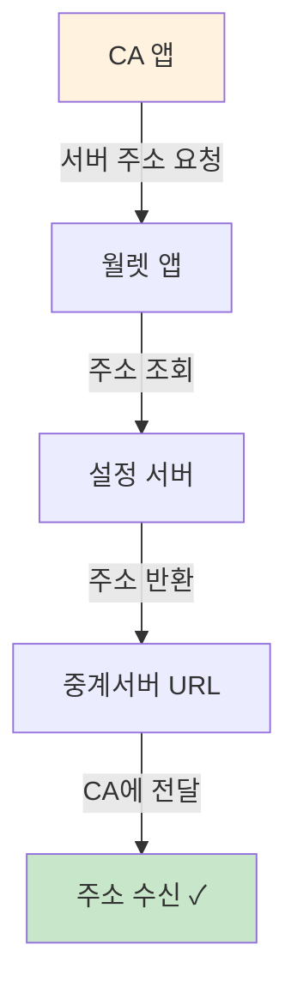
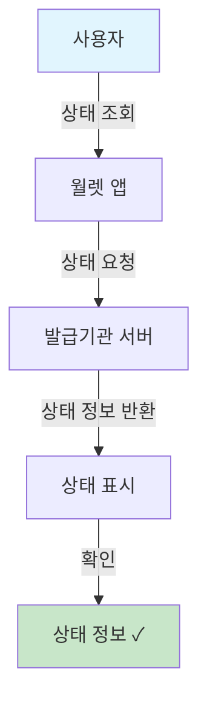
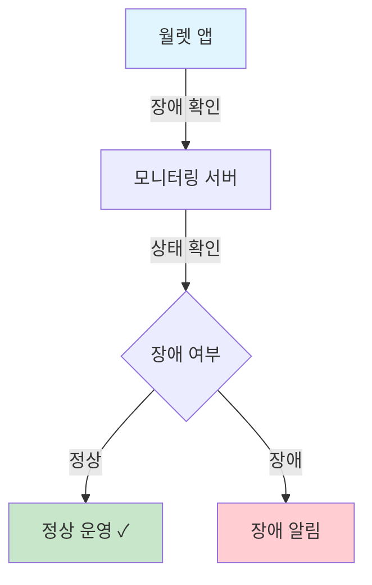

# 5. 조회 서비스 (P410~P430) - 3개

> **관점: 우리은행 모바일 신분증 CA 앱 개발**

---

## P410. 중계서버 주소 조회

**📌 한줄 해석:** VP 제출 시 사용할 중계서버 주소를 동적으로 조회하며, 우리은행 앱에서 이 API를 호출하여 연결 설정을 해야 합니다.

| 순서 | 단계 | 설명 |
|:---:|------|------|
| 1 | 주소 요청 | CA 앱이 중계서버 주소를 요청합니다 |
| 2 | 월렛 앱 처리 | 월렛 앱이 요청을 처리합니다 |
| 3 | 설정 조회 | 설정 서버에서 주소를 조회합니다 |
| 4 | 주소 반환 | 중계서버 URL이 반환됩니다 |
| 5 | CA 전달 | CA 앱에 주소가 전달됩니다 |

---

## P420. VC 상태 상세사유 조회

**📌 한줄 해석:** 고객의 VC가 정지/폐기된 경우 상세 사유를 조회할 수 있으며, 우리은행 앱에서 오류 안내 시 이 정보를 활용합니다.

| 순서 | 단계 | 설명 |
|:---:|------|------|
| 1 | 상태 조회 | 사용자가 VC 상태를 조회합니다 |
| 2 | 요청 전송 | 발급기관 서버에 조회를 요청합니다 |
| 3 | 정보 반환 | 상태 정보가 반환됩니다 |
| 4 | 화면 표시 | 상태와 사유가 표시됩니다 |

**조회 가능 상태:**
| 상태 | 설명 | 우리은행 앱 처리 |
|------|------|------|
| 유효 | 정상 사용 가능 | 정상 진행 |
| 정지 | 일시 중지됨 | 재활성화 안내 |
| 폐기 | 영구 사용 불가 | 재발급 안내 |
| 만료 | 유효기간 경과 | 갱신 안내 |

---

## P430. 장애여부 조회

**📌 한줄 해석:** 거래 전 시스템 장애 여부를 확인하여, 장애 시 우리은행 앱에서 대체 인증 수단 안내를 제공해야 합니다.

| 순서 | 단계 | 설명 |
|:---:|------|------|
| 1 | 장애 확인 | 월렛 앱이 장애 여부를 확인합니다 |
| 2 | 서버 조회 | 모니터링 서버에서 상태를 확인합니다 |
| 3 | 정상 여부 | 시스템 정상 운영 여부를 판단합니다 |
| 4 | 결과 처리 | 정상이면 진행, 장애면 알림 표시 |

---

# 6. 용어 정리 (우리은행 개발 관점)

| 용어 | 설명 | 우리은행 역할 |
|------|------|------|
| **DID** | 분산 식별자 | VP 검증 시 DID로 고객 식별 |
| **VC** | 검증 가능한 자격증명 | 고객이 제출하는 모바일 신분증 |
| **VP** | VC에서 필요 정보만 선택 제출 | 우리은행 서버에서 VP 수신/검증 |
| **CA** | Credential Agent | 우리은행 앱이 CA 역할 수행 |
| **월렛** | 신분증 저장 앱 | 우리은행 앱이 월렛과 연동 |
| **ZKP** | 영지식 증명 | 프라이버시 보호 인증에 활용 |
| **MPM** | 가맹점 QR 스캔 | 영업점/ATM QR 인증 |
| **CPM** | 고객 QR 제시 | 창구 본인확인 |
| **Direct** | 직접 전송 | VP가 우리은행 서버로 직접 |
| **Indirect** | 앱 경유 전송 | VP가 앱을 거쳐 서버로 |
| **Proxy** | 중계서버 경유 | 정부 중계서버 통과 |

---

# 7. 전송 방식 비교표 (우리은행 채널별 적합도)

## 7.1 채널별 추천 방식

| 채널 | 추천 방식 | 설명 |
|------|----------|------|
| 영업점 창구 | QR-CPM | 고객 QR을 직원이 스캔 |
| ATM | QR-MPM, NFC | ATM QR 또는 NFC 태깅 |
| 인터넷뱅킹 | PUSH | 푸시로 본인확인 요청 |
| 모바일뱅킹 | App2App | 앱에서 월렛 호출 |
| 비대면 대출 | PUSH + Signature | 푸시로 서명 요청 |

## 7.2 보안 수준별 추천

| 거래 유형 | 추천 방식 | 보안 수준 |
|----------|----------|:---:|
| 잔액 조회 | App2App Indirect | ⭐⭐ |
| 이체 | App2App Direct | ⭐⭐⭐ |
| 계좌 개설 | PUSH Direct + ZKP | ⭐⭐⭐ |
| 대출 약정 | PUSH Direct + Signature | ⭐⭐⭐⭐ |

## 7.3 구현 난이도

| 방식 | 구현 난이도 | 필요 인프라 |
|------|:---:|------|
| QR-MPM | ⭐⭐ | QR 생성 화면 |
| QR-CPM | ⭐ | QR 스캐너 |
| PUSH | ⭐⭐⭐ | Push 서버 연동 |
| App2App | ⭐⭐ | 앱간 통신 구현 |
| NFC | ⭐⭐⭐ | NFC 리더기 설치 |

---

*이 문서는 우리은행 모바일 신분증 CA 앱 개발 관점에서 56개 프로세스를 도해화한 것입니다.*
